# Concurrent Banking System (bankdb)

Multi-threaded banking system using POSIX threads and synchronization primitives.

## Authors

- Christian Joseph Hernia
- Julo Bretana

## Compilation

```bash
# Standard build
make all

# Debug build with ThreadSanitizer
make debug

# Clean build artifacts
make clean
```

## Usage

```bash
./bankdb --accounts=FILE --trace=FILE [options]
```

### Required Options

| Option | Description |
|--------|-------------|
| `--accounts=FILE` | Initial account balances file |
| `--trace=FILE` | Transaction workload file |

### Optional Options

| Option | Description | Default |
|--------|-------------|---------|
| `--deadlock=STRATEGY` | Deadlock strategy (prevention/detection) | prevention |
| `--tick-ms=N` | Milliseconds per tick | 100 |
| `--verbose` | Print detailed logs | off |

## Examples

```bash
# Simple test
./bankdb --accounts=tests/accounts.txt --trace=tests/trace_simple.txt

# Test with deadlock prevention
./bankdb --accounts=tests/accounts.txt --trace=tests/trace_deadlock.txt --deadlock=prevention

# Test with deadlock detection
./bankdb --accounts=tests/accounts.txt --trace=tests/trace_deadlock.txt --deadlock=detection

# Run all tests
make test
```

## Test Cases

| Test File | Description |
|-----------|-------------|
| `trace_simple.txt` | Test 1: No Conflicts — sequential deposit, withdraw, balance |
| `trace_readers.txt` | Test 2: Concurrent Readers — multiple balance queries at once |
| `trace_deadlock.txt` | Test 3: Deadlock Scenario — two transfers in opposite directions |
| `trace_abort.txt` | Test 4: Insufficient Funds — withdrawal exceeding balance |
| `trace_buffer.txt` | Test 5: Buffer Pool Saturation — 6 transactions > 5 pool slots |

## Trace File Format

Trace files define transaction workloads with the following format:

```
# Comment line
T<id> <tick> <OPERATION> <account> [args...]
```

### Supported Operations

| Operation | Arguments | Description |
|-----------|-----------|-------------|
| `DEPOSIT` | account amount | Add funds to account |
| `WITHDRAW` | account amount | Remove funds from account (aborts if insufficient) |
| `BALANCE` | account | Query account balance |
| `TRANSFER` | from to amount | Move funds between accounts |

### Example
```
T1  0  DEPOSIT   10  5000
T2  1  TRANSFER  10  20  3000
T2  2  BALANCE   20
```

## Output Format

The program outputs:
- Transaction log with timing details
- Simulation summary (committed/aborted, throughput)
- Buffer pool statistics
- Balance conservation check

## Features Implemented

- [x] Multi-threaded transaction execution
- [x] Reader-writer locks for account access
- [x] Deadlock prevention via lock ordering
- [x] Bounded buffer pool with semaphores
- [x] Timer thread for time simulation
- [x] Condition variables for thread synchronization
- [x] Transaction metrics collection
- [x] Balance conservation verification
- [x] ThreadSanitizer validation

## Known Limitations

- Deadlock detection implementation is experimental

## Screenshots
### ThreadSanitizer producing zero warnings on all test cases
- trace_simple
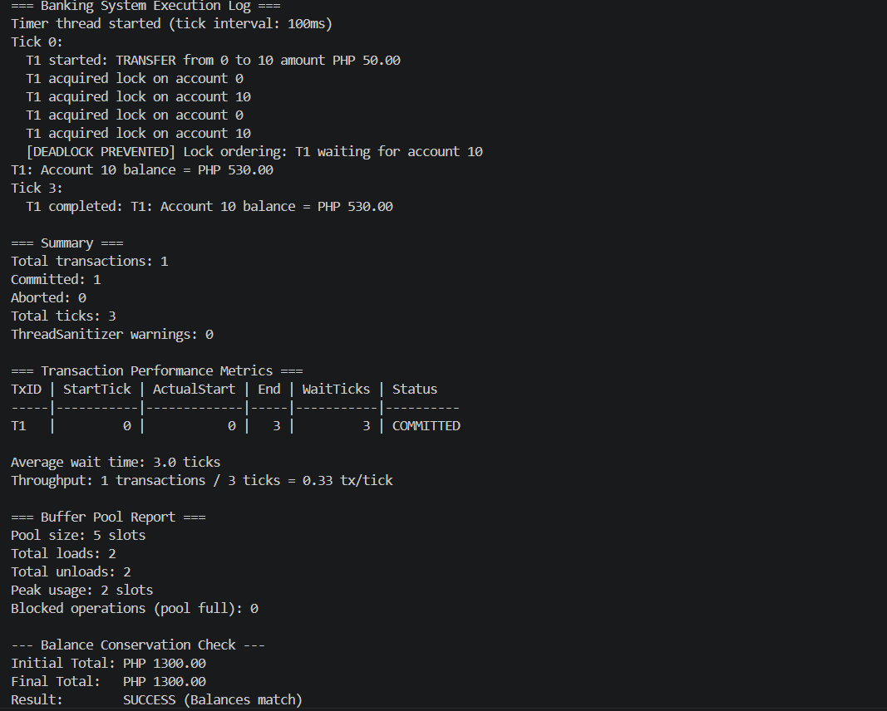
- trace_readers
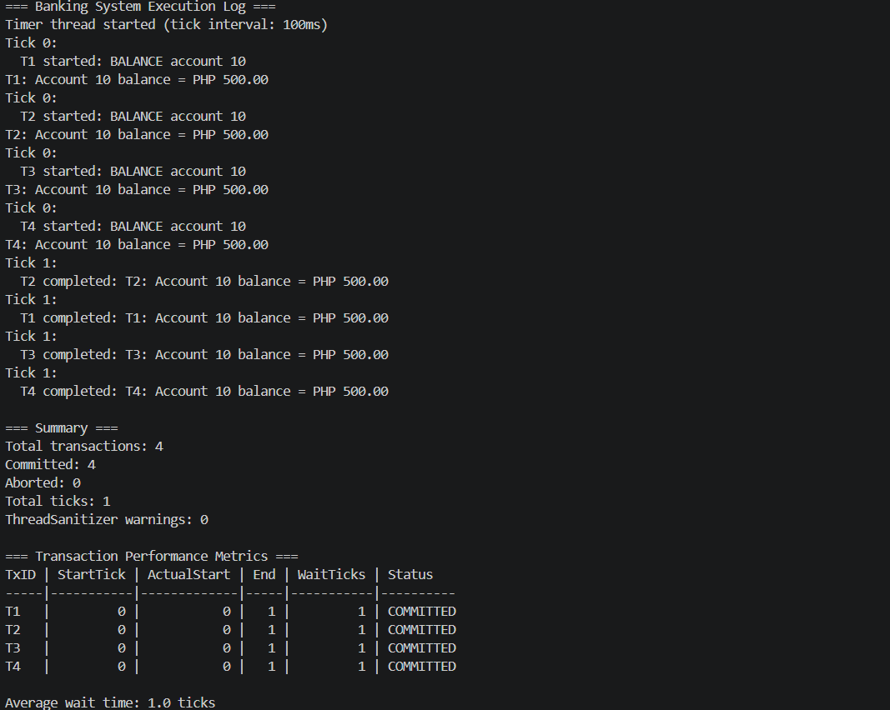
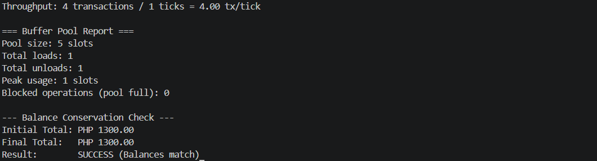
- trace_deadlock
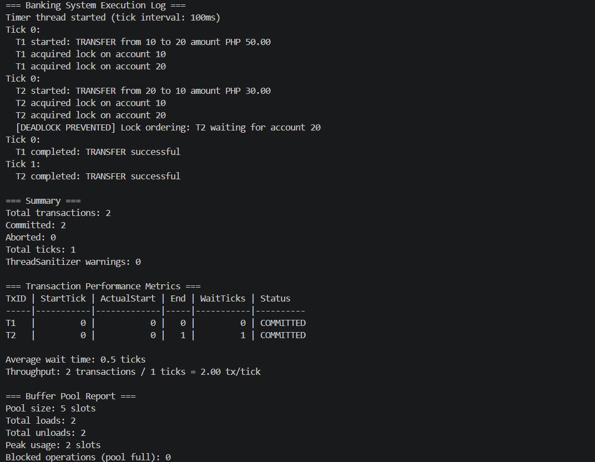
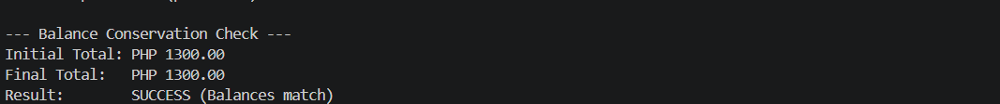
- trace_abort
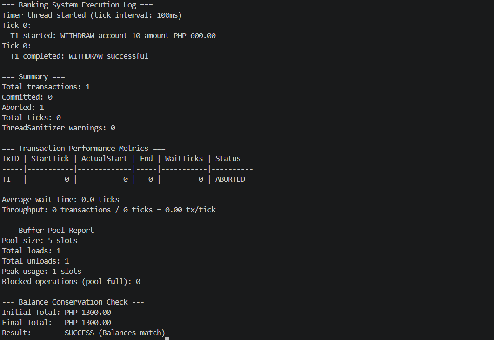
- trace_buffer
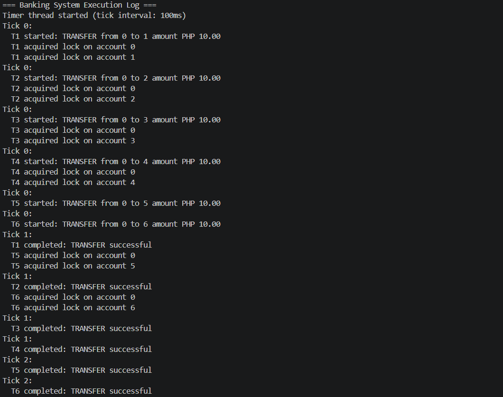
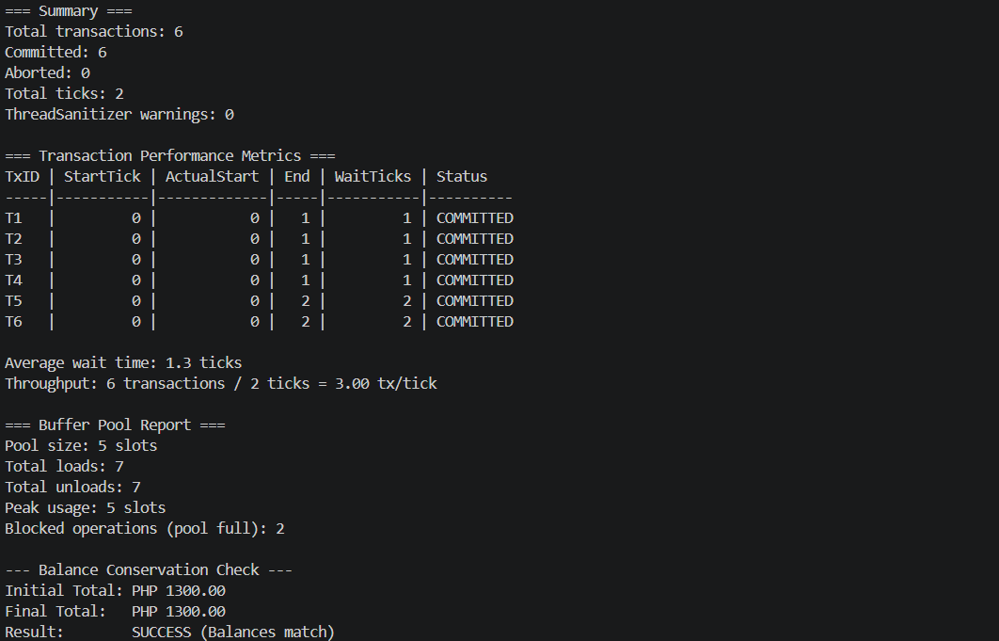

### Deadlock handling (prevention or detection) working correctly
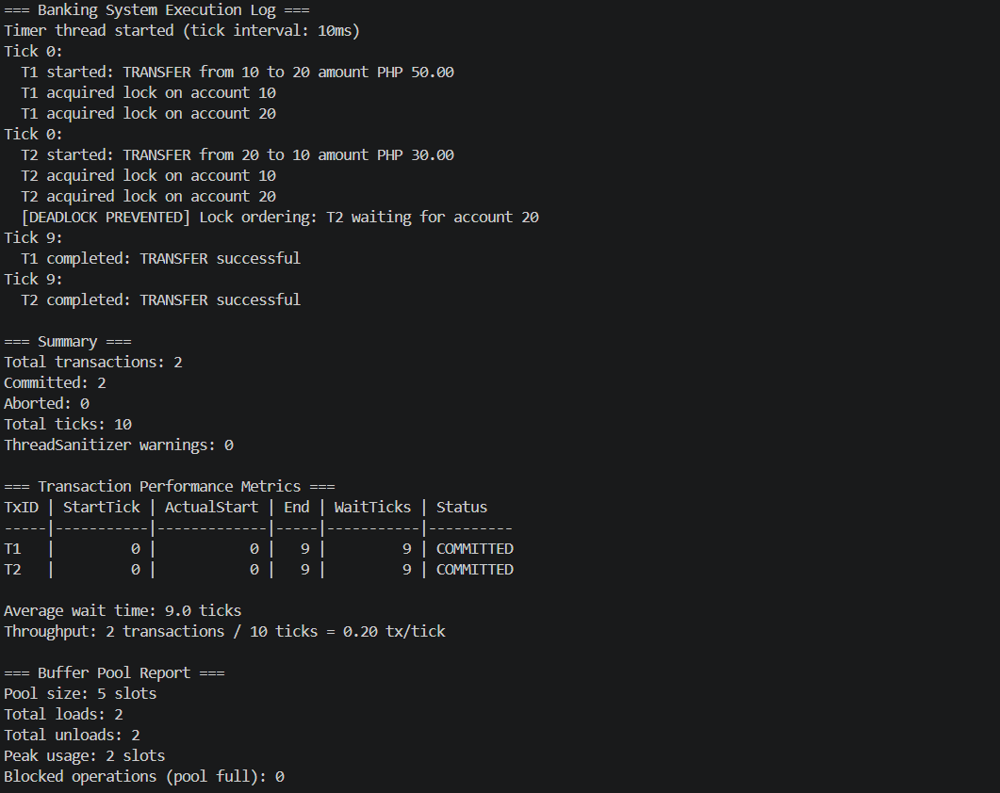
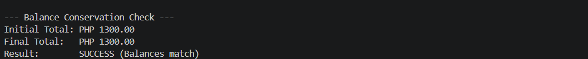

### Buffer pool blocking when full, then unblocking
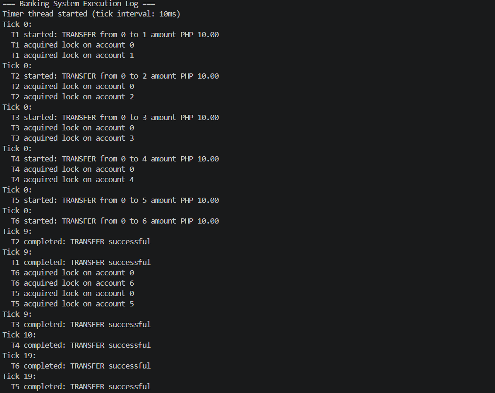
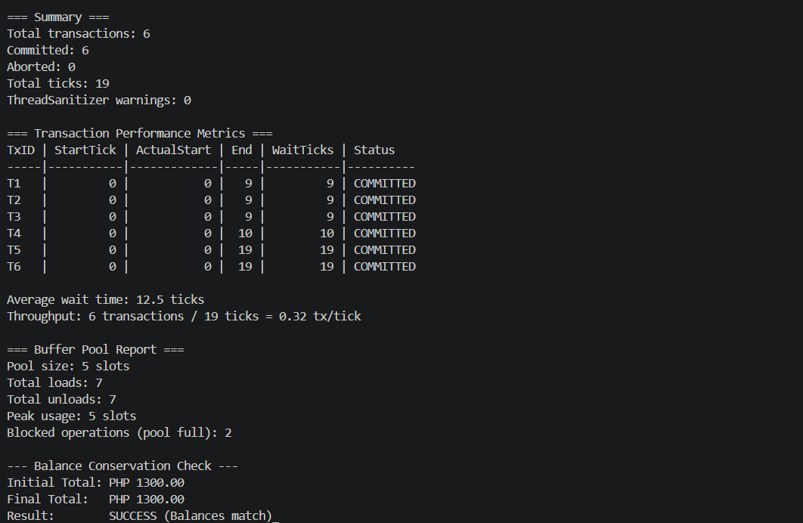

### Balance conservation check passing
- Shown in all the screenshots.
